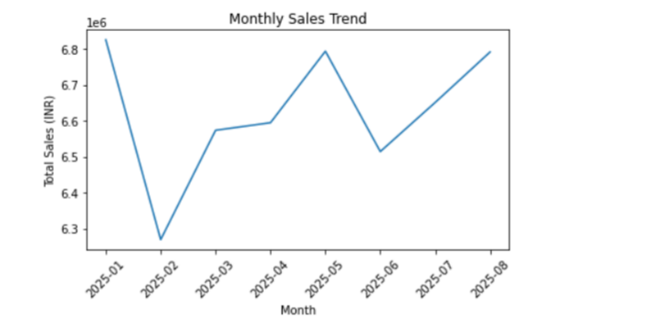
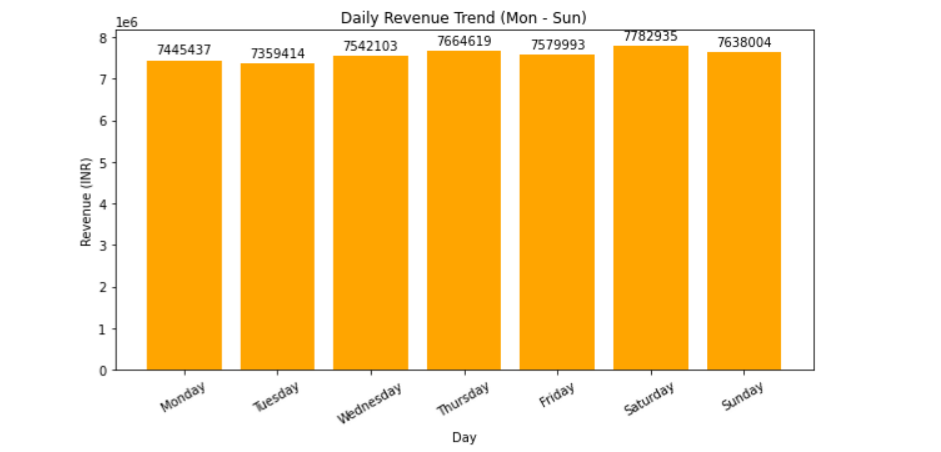
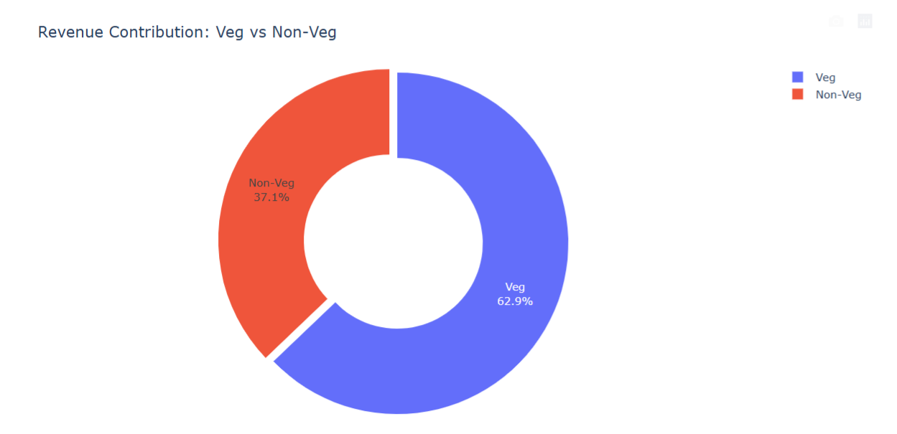
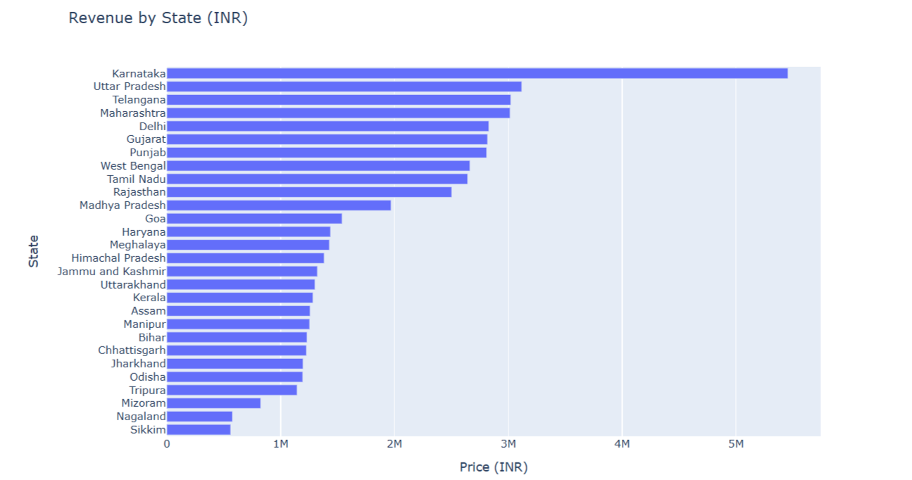

# 🍽️ Swiggy Sales Analysis using Python


---

# 📌 Project Overview

This project presents an end-to-end **Exploratory Data Analysis (EDA)** of approximately **197,430 Swiggy menu records** collected from restaurants across India.

Using **Python**, the project transforms raw menu and pricing data into meaningful business insights through KPI development, feature engineering, trend analysis, and data visualization.

The objective is to demonstrate practical data analytics skills while answering real business questions related to revenue, customer ratings, restaurant performance, and regional sales trends.

---

# 🚀 Project Highlights

| Metric | Value |
|---------|-------:|
| 📄 Records Analyzed | **197,430** |
| 📊 Features | **10** |
| 💰 Total Sales | **₹53.01 Million** |
| 🛒 Total Orders | **197,430** |
| 💵 Average Order Value | **₹268.51** |
| ⭐ Average Rating | **4.34 / 5** |
| 👍 Total Ratings | **5.59 Million** |
| 📈 Business KPIs | **5** |
| 📊 Visualizations | **5** |

---

# 🎯 Business Objectives

The analysis aims to answer the following business questions:

- How much revenue is generated overall?
- How do sales vary month-over-month?
- Which weekdays generate the highest revenue?
- Which states contribute the most revenue?
- What is the revenue contribution of Veg vs Non-Veg dishes?
- How does business perform across quarters?
- What actionable business insights can be derived from the data?

---

# 📂 Dataset Information

| Attribute | Value |
|------------|------:|
| Dataset | Swiggy Menu Dataset |
| Records | 197,430 |
| Features | 10 |
| File Format | Excel (.xlsx) |

## Dataset Columns

- State
- City
- Order Date
- Restaurant Name
- Location
- Category
- Dish Name
- Price (INR)
- Rating
- Rating Count

📄 Detailed column descriptions are available in **DATA_DICTIONARY.md**

---

# 🛠️ Technology Stack

| Category | Tools |
|----------|-------|
| Programming Language | Python |
| Data Manipulation | Pandas, NumPy |
| Data Visualization | Matplotlib, Seaborn, Plotly |
| Development Environment | Jupyter Notebook |

---

# 🔄 Project Workflow

```text
Data Collection
       │
       ▼
Data Understanding
       │
       ▼
Data Cleaning
       │
       ▼
Feature Engineering
       │
       ▼
Exploratory Data Analysis
       │
       ▼
KPI Development
       │
       ▼
Data Visualization
       │
       ▼
Business Insights
```

---

# 📈 Key Performance Indicators

| KPI | Value |
|------|-------:|
| Total Sales | ₹53.01 Million |
| Total Orders | 197,430 |
| Average Order Value | ₹268.51 |
| Average Rating | 4.34 ⭐ |
| Total Ratings | 5.59 Million |

---

# 📊 Exploratory Data Analysis

## 1️⃣ Monthly Sales Trend

<p align="center">

</p>

### Insight

- Sales remained relatively stable throughout the analysis period.
- January recorded the highest monthly revenue.
- Revenue recovered steadily after February, indicating sustained customer demand.
- The overall trend suggests healthy business stability across the observed period.
- Promotional campaigns during lower-performing months could further improve revenue consistency.

---

## 2️⃣ Daily Revenue Trend

<p align="center">

</p>

### Insight

- Revenue remained relatively consistent throughout the week.
- Saturday generated the highest revenue.
- Tuesday recorded the lowest revenue.
- Customer demand increased towards weekends.
- Weekend staffing and inventory planning should be prioritized to accommodate higher order volumes.

---

## 3️⃣ Veg vs Non-Veg Revenue Contribution

<p align="center">

</p>

### Insight

- Veg dishes contributed approximately **63%** of total revenue.
- Non-Veg dishes contributed approximately **37%**.
- Vegetarian offerings remain the primary revenue driver.
- Expanding premium vegetarian options may further increase revenue.
- Targeted promotions can improve Non-Veg sales contribution.

---

## 4️⃣ Revenue by State

<p align="center">

</p>

### Insight

- Karnataka generated the highest revenue.
- Uttar Pradesh, Telangana, Maharashtra, and Delhi were major revenue contributors.
- Revenue distribution varied significantly across states.
- Lower-performing states present opportunities for business expansion and localized marketing campaigns.

---

## 5️⃣ Quarterly Performance Summary

| Quarter | Total Sales | Orders | Avg Rating | Avg Order Value |
|---------|------------:|--------:|-----------:|----------------:|
| 2025 Q1 | ₹19.67 Million | 73,096 | 4.34 | ₹269.07 |
| 2025 Q2 | ₹19.90 Million | 74,163 | 4.34 | ₹268.36 |
| 2025 Q3* | ₹13.44 Million | 50,171 | 4.34 | ₹267.93 |

> **Note:** Q3 contains only July data and therefore represents a partial quarter.

### Insight

- Q2 generated the highest revenue.
- Revenue remained stable during the first half of the year.
- Customer ratings remained consistently high throughout all quarters.
- Average Order Value remained nearly constant, indicating stable customer spending behavior.
- Future revenue growth should focus on increasing order volume rather than increasing prices.

---

# 💡 Business Insights

- Karnataka emerged as the strongest revenue-generating state.
- Weekend demand consistently exceeded weekday demand.
- Veg dishes generated the majority of revenue.
- Average customer satisfaction remained above **4.3** throughout the analysis period.
- Customer spending behavior remained highly consistent.
- Revenue growth opportunities lie in customer acquisition and geographical expansion.

---

# 🔍 Analysis Performed

- ✔ Data Cleaning
- ✔ Exploratory Data Analysis (EDA)
- ✔ Feature Engineering
- ✔ KPI Development
- ✔ Monthly Sales Analysis
- ✔ Daily Revenue Analysis
- ✔ State-wise Revenue Analysis
- ✔ Quarterly Performance Analysis
- ✔ Veg vs Non-Veg Classification
- ✔ Business Insight Generation

---

# 📖 Key Learnings

Through this project, I strengthened my understanding of:

- Data Cleaning using Pandas
- Feature Engineering
- Exploratory Data Analysis
- Time-Series Analysis
- KPI Development
- Business Storytelling
- Data Visualization using Matplotlib & Plotly
- Converting raw data into actionable business insights

---

# 📁 Repository Structure

```text
swiggy-sales-analysis-python/
│
├── data/
│   └── swiggy_data.xlsx
│
├── images/
│   ├── monthly_sales_trend.png
│   ├── daily_revenue_trend.png
│   ├── revenue_by_state.png
│   └── veg_vs_nonveg_revenue.png
│
├── notebook/
│   └── Swiggy_Sales_Analysis.ipynb
│
├── README.md
├── DATA_DICTIONARY.md
├── requirements.txt
├── LICENSE
└── .gitignore
```

---

# ⚙️ Installation

Clone the repository

```bash
git clone https://github.com/AAYUSH006/swiggy-sales-analysis-python.git
```

Navigate to the project

```bash
cd swiggy-sales-analysis-python
```

Install dependencies

```bash
pip install -r requirements.txt
```

Launch Jupyter Notebook

```bash
jupyter notebook
```

Open

```text
notebook/Swiggy_Sales_Analysis.ipynb
```

---

# 🚀 Future Enhancements

Potential improvements include:

- Interactive Power BI Dashboard
- Restaurant Performance Dashboard
- City-wise Sales Analysis
- Customer Segmentation
- Price Distribution Analysis
- Predictive Sales Forecasting
- Streamlit Web Application

---

# 👨‍💻 Author

## Aayush Agarwal

Aspiring **Data Analyst** passionate about solving business problems using **Python**, **SQL**, and **Power BI**.

---

# ⭐ Support

If you found this project helpful, consider giving it a ⭐ on GitHub.

Feedback and suggestions are always welcome!
